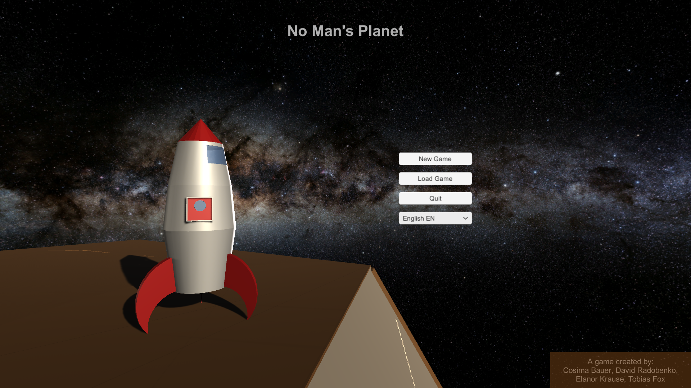
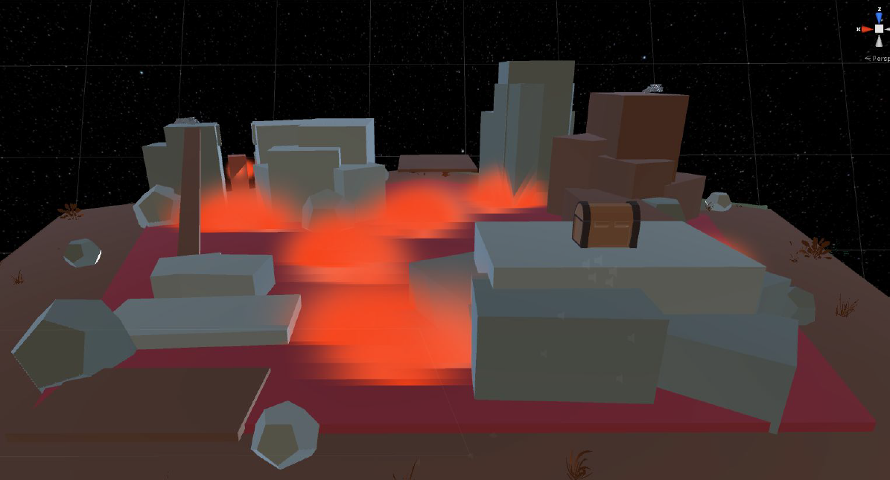
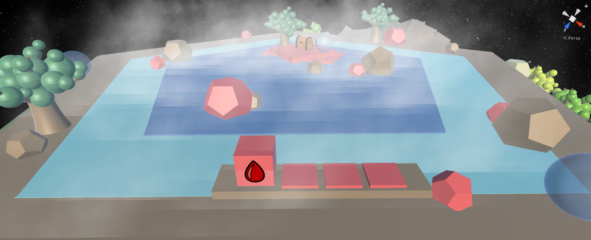
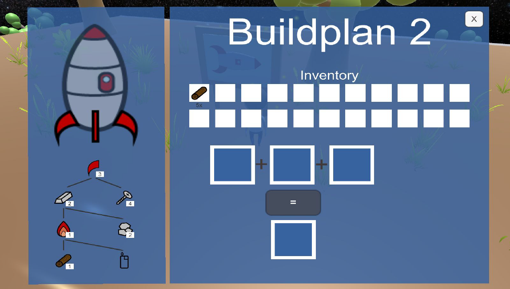
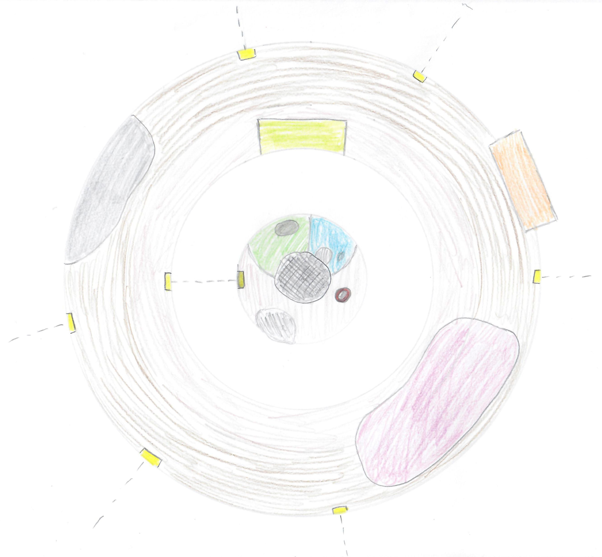
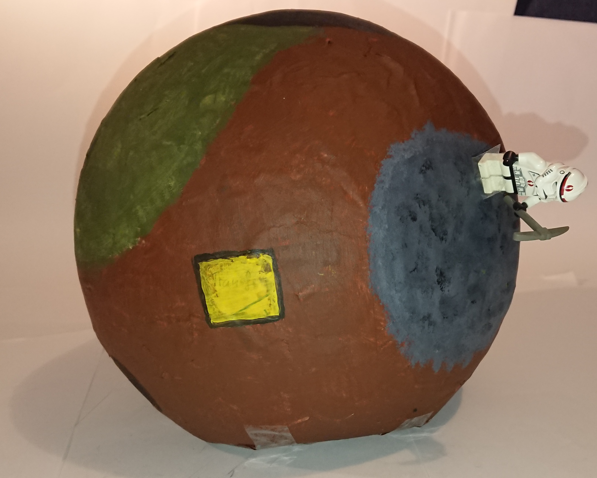
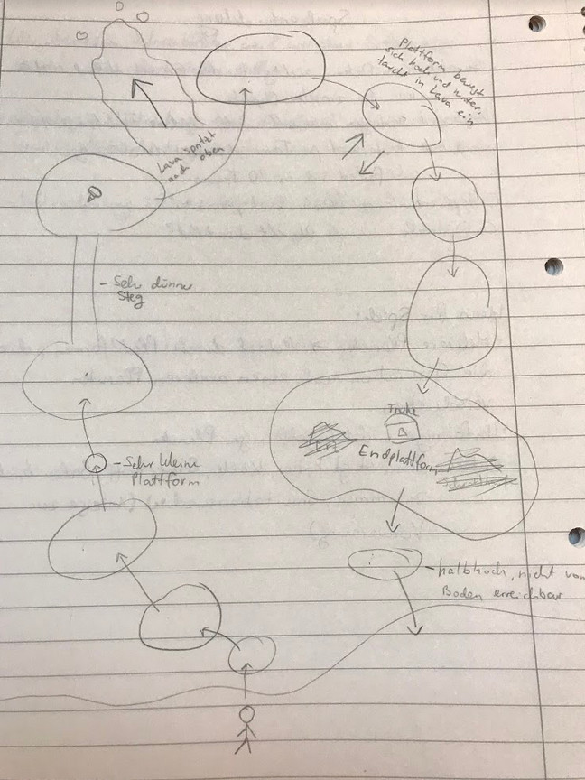
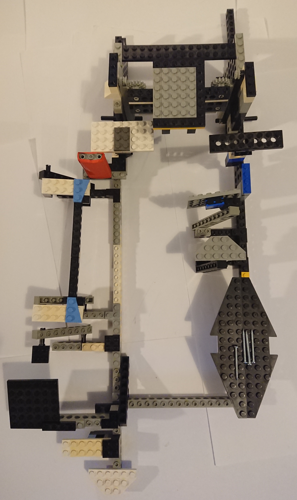

# No Man's Planet

    

  

    <a href="./doc/videos/NoMansPlanet_Trailer.mp4">Trailer</a>

  

    
    

  

    
    

  

In the fifth semester of my bachelor studies at the Beuth University of Applied Sciences I developed this game in a four-member team. We used Unity with C#. In addition to the implementation of various features, I supported the team as Scrum Master. The topic was "Little Rocket Man" and the game focusses to explore an open-world and to solve tricky puzzles.

During the development we also made a physical prototype to improve the game experience. In the picture you can see for example the home planet.  

  
 
In the next two picture is the lava jump passage shown.  

  
 
Furthermore we made some playtesting sessions with friends or familiy member to fix some bugs and gain feedback.  

## Milestones

During the semester we had 6 milestones and here you can see the documentation of each milestone:

1. [Game proposal](./doc/01_game_proposal.md)  
- idea and short description of the game, time schedule, first sketches
2. [Prototype](./doc/02_game_prototype.md)
- advanced sketches, physical prototype to improve the game experience
3. [Progress](./doc/03_progress.md)
- some 3D assets, basic game logic, character, implemented some puzzles
4. [Alpha release](./doc/04_alpha_release.md)
- color schema, minimap, new HUD, oxygen and life system 
5. [Playtesting](./doc/05_playtesting.md)
- playtesting session with detailed feedback, improvement list
6. [Game Conclusion](./doc/06_conclusion.md)  
- improved feature list, some retrospective about the project

If you have any questions or want to send a bug report you can write me on tobiasfox@gmx.net.
