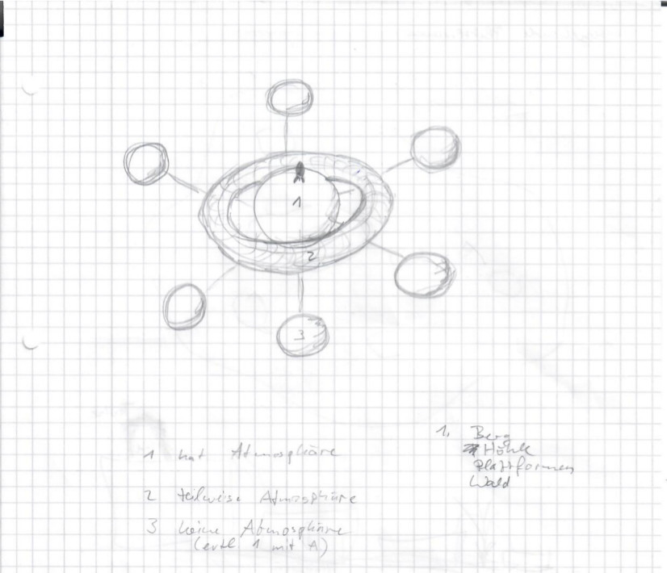
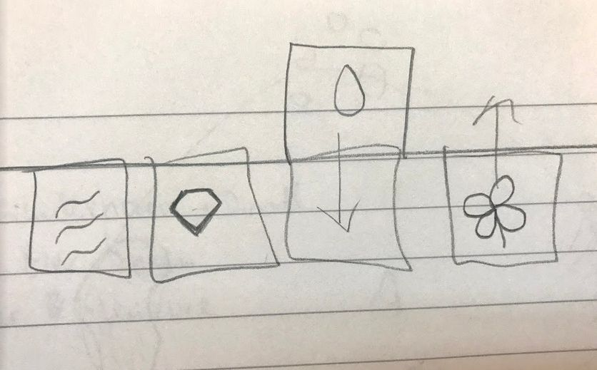
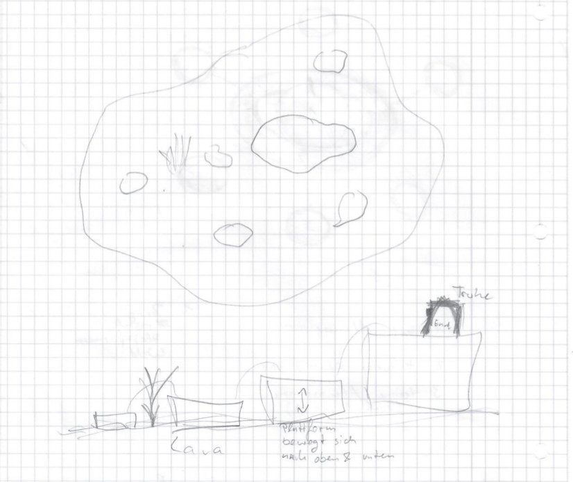

### Titel: No Man's Planet

#### 1.Spielbeschreibung 

**Kurzbeschreibung**  
In unserem Puzzle-Spiel "No Man's Planet" geht es, wie das Kursthema "Little Rocket Man" schon vermuten lässt, um einen Astronauten, der auf einem Planeten gestrandet ist. Ziel des Spiels ist es, dem Astronauten eine Rakete zu bauen, die ihn zurück zu seinem Heimatplaneten bringt. Der Spieler wird es aber nicht einfach haben diese Aufgabe zu erfüllen, da ihm die nötigen Materialien und Ressourcen fehlen.

Die Aufgabe des Spielers, der den Astronauten steuert, ist es, die nötigen Materialien und Ressourcen durch Rätsel auf dem Planeten zu finden um schlussendlich seine Rakete aufzubauen. Der Spieler startet mit einem Schraubenschlüssel und einem Feuerzeug als Werkzeug. Mit dem Schraubenschlüssel kann man bereits Schrotthaufen kaputtschlagen, um seine ersten Materialien, Schrauben, zu erhalten. Im Laufe des Spiels erhält der Spieler weitere Werkzeuge, mit denen er neue Materialien beschaffen kann. Abbaustellen sind zum Beispiel Berge und die bereits erwähnten Schrotthaufen.

Es gibt drei verschiedene Arten von Materialien: Basis-Materialien, die der Spieler direkt auf dem Planeten finden kann. Mittel-Materialien, die aus Basis-Materialien gecraftet werden und wiederum zum weiteren craften von End-Materialien benötigt werden. Diese End-Materialien werden dann zum stetigen Aufbau der Rakete eingesetzt. Um zu wissen, welche Materialien zum craften gebraucht werden, schaltet der Spieler im Laufe des Spiels verschiedene Baupläne frei.
Manche Materialien liegen frei auf dem Planeten rum und können direkt aufgesammelt werden, andere können erst durch das Lösen von Rätseln erreicht werden. Es gibt Materialien, die sehr häufig vorkommen, weil sie oft gebraucht werden, und Materialien, von denen nur zwei Stück im ganzen Spiel vorkommen.

Der Spieler kann sich von Anfang an frei auf dem Planeten bewegen, allerdings sind mache Bereiche des Planeten noch nicht betretbar und müssen erst mit Hilfe von Werkzeugen oder durch Lösen von Rätseln freigeschaltet werden. Solche Bereiche können zum Beispiel Höhlen sein, für die erst eine Lichtquelle benötigt wird oder Plattformen, für die man erst eine  Leiter bauen muss.
Der Hauptplanet ist der Erde nicht unähnlich und besitzt eine Atmosphäre, sowie Flora und Fauna.  

  

Er ist von einem riesigen ringförmigen Planeten umgeben, der anfangs noch nicht betretbar ist und erst nach einer gewissen Anzahl von Rätseln freigeschaltet wird. Der Wechsel von einem Planeten zum anderen erfolgt durch Gravitationsplattformen. Wenn der Spieler auf eine dieser Platttformen steigt, wird sie aktiviert und die Gravitation des Planeten, auf dem man sich befindet, wird ausgeschaltet. Dafür wird die Gravitation des Zielplaneten angeschaltet und der Spieler wird dorthin gezogen. Der Torus-Planet zeichnet sich durch Gebiete aus, in denen es keine Atmosphäre gibt, der Spieler hat also nur eine bestimmte Menge an Sauerstoff von seinem Raumanzug, die er zum Überleben braucht.  Weitere Sauerstoffbehälter können ggf. in der Region gefunden werden. Dies macht den Torus wesentlich schwerer zum Überleben und erfordert Vorausplanungsvermögen.  Zusätzlich  gibt es einige Gebiete, in denen die Gravitation sich stellenweise wechselt, dort besteht die Gefahr, dass der Spieler in den Weltraum gezogen wird. Um den Torus schweben außerdem noch weitere kleinere Planetoiden, von denen manche sich so nah befinden, dass der Spieler sogar nur durch Springen zu ihnen wechseln kann. Auch diese Planetoiden unterscheiden sich sehr vom Hauptplaneten in Hinsicht auf Gravitation und Atmosphäre. Sowohl auf dem Torus als auch auf den Planetoiden befinden sich mehrere Rätsel zur weiteren Materialbeschaffung.  Manche der Planetoiden sind eigenständige Rätsel.  

  

Die Rätsel werden immer schwieriger mit der Zeit und benötigen sowohl Denkvermögen als auch Geschicklichkeit und Schnelligkeit. Es wird mit Elementen, Gravitation und verschiedenen Höhen gespielt. Für jeden Bauplan gibt es geeignete Rätsel wo man die entsprechenden Materialien bekommt. Es werden mehrere kleine Rätsel auftauchen, manche umfangreiche Rätsel geben und Rätsel die aufeinander aufbauen. Die Rätsel sollten sich nicht wiederholen und abwechslungsreich sein.

Es werden keine Hinweise gegeben und der Spieler wird nicht geleitet, er muss also seinen Weg durch das Spiel selber finden. Zum Anfang des Spiels sieht man daher bereits ein paar Anlaufstellen, die den Spieler auf den richtigen Weg bringen sollen.

Start- und Endpunkt des Spiels ist die Rakete. Dort befinden sich auch die Baupläne, an denen man seine gesammelten Materialien zu neuen Gegenständen verbinden kann.

Den Charackter sieht man von einer Top-Down-Perspektive und die Kamera folgt dem Spieler während er sich auf dem Planeten fortbewegt. Der Planet soll auch nicht realistisch groß sein aber auch nicht zu klein sein, damit genügend Platz für die einzelnen Regionen mit den Rätseln sind. Durch die Kamera sieht man dann auch das man auf einem nicht so großen Planeten rumläuft und den Planeten einfach umrunden kann.

**Gameplay**  
Das Spiel soll einfach zu bedienen sein, aber umfangreiche Aktionen bieten. So können auch unerfahrene Spieler sich an einem Puzzle/Crafting Spiel versuchen. 

Das Herausfordende in unserem Spiel ist das Lösen von Rätseln und das planen einer Strategie um schwere Terrains zu durchqueren. Der Anfang soll dem Spieler helfen mit den grundelementen des Spiels vertraut zu werden um später dann seine Erfahrungen auf die Probe zu stellen. Ebenso wird es auf dem Planeten Stellen geben, wo andere Gravitationskräfte herrschen und den Astronauten möglicherweise stärker bzw. schwächer an dem Planeten anziehen.

Der Spieler kann sich frei auf dem Planeten bewegen und mit Sachen interagieren. Er kann in alle Rchtungen laufen und hat die möglichkeit zu springen. Auf diese Weise können die Rätsel gelöst werden.
Das Inventar kann man mit einem Knopfdruck aufgerufen werden. Im Inventar sieht man seine eingesammelten Gegenstände und Materialien. Am Bauplan kann man die Elemente aus dem Inventar dann zu neuen Gegenständen kombinieren. 

**Spielablauf**  
Der Spieler beginnt mit einem Schraubenschlüssel und einem Feuerzeug, sowie einer bestimmten Menge Holz als Grundressource.
Am Anfang wird der Spieler, um die Stuereung des Spiels zu lernen, vorerst ein paar Schrauben aus Schrotthaufen sammeln und mithilfe des gegebenen Holz eine erstes Item craften. Anschließend wird er weitere Werkzuege suchen um mehr Bereiche des Planeten zu erreichen. Die Werkzeuge werden teilweise auch zum bearbeiten der Rätsel benötigt, durch dessen Lösung der Spieler die nötigen Ressourcen für den ersten Bauplan erhält. Der Bauplan der Rakete besteht aus 10 Teilen:
1. Füße 3x
2. 4 Wände (untere Ebene)
3. Motor
4. 3 Wände (mittlere Ebene)
5. Luke
6. Couch
7. 3 Wände (obere Ebene)
8. Cockpit
9. Spitze
10. Rakete gestalten (z.b. Namen anmalen)
Nach dem Abschluss eines Bauplans wird der nächste freigeschaltet, genauso wie die dafür benötigten Rätsel.

**Rätselskizzen**  

  

   

**Grafik**  
Die Grafik soll nicht realistisch sein und überwiegend comichaft bleiben. Der Charakter und die Gegenstände sind sehr klein, aber deutlich dargestellt. Der Charakter wird hauptsächlich animiert während die meisten Objekte oder der Terrain statisch bleibt. Es wird viel mit Partikel Systemen gearbeitet um Wasser, Lava oder anderes zu Simulieren. 

#### 2.Technische Elemente

Das Spiel ist als 3D Single-Player gedacht, in Third-Person-Perspektive. Es soll auf PCs und Konsolen laufen, Input kann also sowohl durch Keyboard als auch Controller erfolgen. Zur Entwicklung des Spiels nutzen wir die Unity Engine.

#### 3. "Big Idea"

Das Spiel zeichnet sich durch eine außergewöhnliche Plattform aus: Ein fremder Planet, auf dem sich der Spieler frei bewegen kann. Die Gravitation des Planeten ermöglicht es, diesen komplett zu umrunden, was eine einmalige Ansicht auf das Spiel verleiht. Einzigartige Gebiete mit verschiedener Flora, Atmosphäre und Gravitationsstärke wecken die Neugierde, immer mehr Bereiche freizuschalten und zu entdecken.

Die innovative Idee des Spiels ist das Verbinden von Crafting und Puzzle. Die Endteile der Rakete müssen aus Einzelteilen erstellt werden, die auf dem Planeten verstreut sind und vom Spieler gefunden werden. Manche dieser Teile können erst durch das Lösen von Rätseln erhalten werden. Da es keine Hinweise auf den Aufenthaltsort der Teile oder die Lösungen der Rätsel gibt, ist hier Nachdenken gefragt. Der Spieler wird nicht geleitet, sondern muss seinen eigenen Weg finden. Knifflige Rätsel erfordern Geschicklichkeit und Grips, neue und seltene Bauteile fördern den Suchtfaktor.

Das Spiel ist für Personen ab 12 Jahren gedacht und wendet sich vor allem an Casual Player, da die Spielsteuerung sehr einfach gehalten ist und das Spiel zwischendurch gestoppt werden kann. Es bietet Unterhaltung für alle, die gerne knobeln und gefordert werden wollen.

#### 4. Entwicklungszeitplan

Funktionales Minimum (Layer 1):  
Von der Gestaltung her ist der Astronaut fertig designed und der Hauptplanet ist bereits fertig gestaltet mit allen Stellen, wo Werkzeuge gefunden werden können.
Der Spieler kann den Astronauten steuern und auf dem Planeten herumlaufen. Er kann den Schraubenschlüssel bereits einsetzen und aus Schrotthaufen Schrauben herausholen. Außerdem ist es ihm möglich, aus den gesammelten Schrauben und dem bereitgestellten Holz die Leiter zu craften.
Ziel ist es, dass der erste Bauplan (Füße) bereits erfolgreich abgeschlossen werden kann. Der Astronaut kann also mit den Werkzeugen Feuerzeug, Schraubenschlüssel, Axt und Spitzhacke umgehen und kann craften.
Das Menü/Inventar ist bereits vollständig, da es die Grundlegenden funktionen des Spiels enthält, wie beispielsweise craften oder Werkzeug wechseln.

Minimalziel (Layer 2):  
Der Hauptplanet hat alle nötigen Funktionen und gestalterischen Elemente, sodass der zweite Bauplan (4 Wände) vollständig abgeschlossen werden kann. Hierzu müssen die vier ersten Rätsel (Steinplatten, Kisten, Lava, Röhre) implementiert werden. Der Planet benötigt also zusätzlich einen Lava- und Wassersee, sowie einen Ein- und Ausgang zur Röhre, welche durch den Planeten verläuft.

Ziel (Layer 3):  
Das Planetensystem ist grundlegend komplett gestaltet. Damit ist gemeint, dass die geplanten Bereiche, wie der Torus und die äußeren Planeten erreichbar sind und die wichtigsten Teile bereits ihre gewünschte Funktion haben. Es sollen der dritte und vierte Bauplan (Motor, 3 Wände) abgeschlossen werden können. Hierzu werden die Transferplattformen zum Torus sowie vier weitere Rätsel (Racketen Wrack, Labyrinth, Gravitation, Unsichtbare Plattformen) benötigt.
Weitere Ziele sind ein Balancesystem, welches bestimmt wie viele Ressourcen durch welches Rätsel erhalten werden können, das einbinden von Hintergrundmusik und Soundeffekten, sowie die gestaltung des Hauptmenüs und die Möglichkeit seinen Spielstand zu speichern/laden. Zusätzlich müssen die Rätsel für die nächsten Baupläne bestimmt werden.

Wunschziel (Layer 4):  
Wunschziel ist es so viele Baupläne wie möglich abschließen zu können. Hierzu werden die dafür zu überwindenden Hindernisse und Rätsel in das Design des Planetensystems mit aufgenommen.

Extras (Layer 5):  
Grundsätzlich sollten alle 10 Bauplan-Teile abgeschlossen werden können, dazu müssen alle Hindernisse und Rätsel auf dem Planetensystem fertig gestaltet sein. Als Schwierigkeitserhöhung können noch Gegner programmiert werden. Zusätzliche Erweiterungen die machbar sind wären ein Tutorial am Anfang und die Umsetzung des Spiels für Smartphones.

Die Ticketverwaltung findet über Trello statt.

#### 5. Teamaufteilung

Alle: Game Designer  

Cosima: Künstler, Programmiererin  
David: Künstler, Programmierer  
Elanor: Programmiererin, Qualitätssicherung  
Tobias: Programmierer, Qualitätssicherung, Produzent  