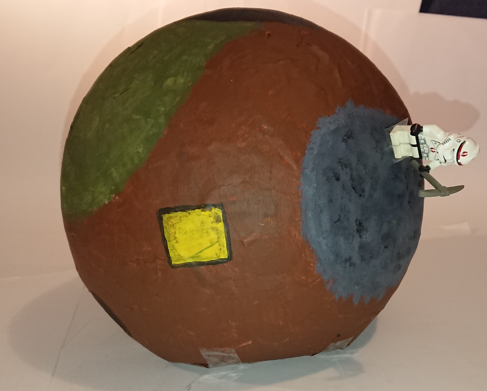

# Der Prototyp

## Allgemeines  
Der Papierprototyp hat uns eine bessere Vorstellung von dem Aufbau der Planeten gegeben, wo jedes Rätsel sich befindet und wie viel Platz jeweils benötigt wird. Dadurch konnten wir zum Beispiel feststellen, dass wir gut mit einem relativ kleinen Planeten arbeiten können, sodass das Spielerlebnis bleibt aber dennoch alle geplanten Regionen genügend Platz haben. Außerdem haben wir bemerkt, dass auf dem Torus noch viel mehr Platz für Rätsel ist als gedacht, wodurch wir auf nicht so viele Außenplaneten ausweichen müssen wie erwartet.  
Die Ansicht des Inventar haben wir nochmal komplett geändert, es gibt jetzt neben dem Inventar für die Materialien einen extra Slot für Werkzeuge. Die Ansicht des Bauplans wurde komplett erst mit dem Prototypen entwickelt, was sehr wichtig war, da dieser die Funktion des craften beeinhaltet. Das craften ist ein zentraler Teil unseres Spiels und nun ist festgelegt wie diese Aktion genau funktionieren soll.
Den Spielablauf mussten wir nicht oft wiederholen, weil wir diesen schon im vorraus sehr genau geplant hatten. Dafür mussten wir die Rätsel detaillierter ausarbeiten, da wir bei vielen bisher nur grobe Ideen hatten. Jetzt sind alle Rätsel, die zum Abschluss des vierten Bauplans benötigt werden, genau geplant und haben angemessene Schwierigkeitsgrade.  
Insgesamt haben wir an der grundlegenden Spielidee nicht viel verändert, konnten aber durch den Prototypen eine klarere Sturktur erschaffen, wie die einzelnen Funktionen umgesetzt werden sollen.  

## Hauptplanet mit Bauplan  
Der Hauptplanet ist Startpunkt des Spiels. Auf ihm befinden sich verschiedene Gebiete die der Spieler frei erkunden, jedoch teilweise durch das Lösen von Rätseln erst erreichen kann. Die einzelnen Gebiete sind ein Berg, ein Wald, ein See, ein Lavasee, eine Höhle und die Raketenbaustelle mit einem Bauplanschild.  

## Torus  
Der Torus kann über eine Transferplattform vom Hauptplaneten aus erreicht werden. Er besteht genauso wie der Hauptplanet aus verschiedenen Gebieten, die hier jedoch hauptsächlich an die zu lösenden Rätsel (Labyrinth, Raketenwrack, Gravitation, unsichtbare Plattformen) angepasst sind. vom Torus aus können noch kleinere Außenplaneten erreicht werden, die jedoch erst später im Spiel freigeschaltet werden.

## Charakter
Für den Charakter haben wir eine Lego-Figur genommen. An die Füße haben wir Magneten geklebt um die Figur um den Planeten herumzubewegen. Im Inneren des Hauptplaneten befindet sich ebenfalls ein Magnet. Mithilfe dieser beiden Magneten wird die Gravitation dargestellt. (siehe Beschreibung des Hauptplaneten)  

## Materialien / Werkzeuge
Wir haben eine Übersicht aus allen Materialien und Werkzeugen zusammengestellt.  
  
Für das Gameplay des Prototypen haben wir die Werkzeuge als Lego-Objekte, sodass wir das aktive Werkzeug an die Lego-Figur anstecken können.

## Inventar
Das Inventar besteht aus zwei Teilen, einem für die Werkzeuge und einem für die Materialien. In der unteren linken Ecke des Bildschirms ist immer das gerade ausgewählte Werkzeug angezeigt. Mithilfe einer Taste kann direkt durch alle vorhandenen Werkzeuge gewechselt werden. Alternativ kann mithilfe einer Tastenkombination das Werkzeuginventar geöffnet werden, aus dem man direkt ein Werkzeug auswählen kann. Das Materialieninventar wird durch einen Rucksack in der oberen rechten Ecke dargestellt. Es kann ebenfalls durch eine Taste geöffnet werden und zeigt dann alle Materialien an, die man zu diesem Zeitpunkt besitzt. Diese Ansicht ist lediglich dazu da dem Spieler die Möglichkeit zu geben jederzeit zu wissen welche Materialien er Besitzt und er somit weiß, welche er noch benötigt.  

## Bauplan mit Crafting  
Der Bauplan befindet sich auf dem Hauptplaneten an der Raketenbaustelle. Wenn der Astronaut sich dem Plan nähert erscheint eine neue Ansicht. Auf dieser sieht man einen Plan der Rakete und den jeweils aktuellen Bauplan, der anzeigt wie oft man welche Materialie braucht, um den Plan abzuschließen und den nächsten freizuschalten. Neben diesen Angaben befindet sich der Bereich zum craften. Hier kann man Materialien aus der unteren Leiste einfügen, sodass ein neues Material entsteht, welches dann wieder in der unteren Leiste hinzugefügt wird. Hat man genügend Materialien um eine Stufe des Bauplans abzuschließen wird dieses Material farbig unterlegt.  

## Truhe
Truhen beinhalten verschiedene Materialien und werden meistens am Ende eines Rätsels gefunden.  

## Berg
Den Berg haben wir aus Lego gebastelt.  

Um den Berg zu erklimmen, muss die Leiter hergestellt worden sein. Die Mauer am "Ende" des Berges stellt eine Stelle des Berges dar, welche nicht erklommen werden kann. 

## Wald mit Höhle
Im Wald findet man die Alienpflanze, die man zum Lösen eines der Rätsel braucht. Außerdem befindet sich dort die Höhle. Der Höhleneingang ist noch versperrt und muss erst mit der Spitzhacke frei gemacht werden. In der Höhle findet man die Axt, einen Diamanten und eine Erzabbaustelle. Mit der Axt kann dann im Wald von den Bäumen Holz gewonnen werden.  

## Rätsel

### Steinplatten 

Das Rätsel besteht aus 2 Steinplatten, die als Schalter agieren. Aktiviert werden die Steinplatten per Gewicht. Auf dem Berg findet der Spieler einen rollbaren Stein. Dieser kann von dem Berg runtergestoßen und auf eine der Steinplatten platziert werden. Die andere Steinplatte aktiviert der Spieler, indem er sich auf diese stellt. Sind beide aktiviert öffnet sich eine Falltür, wo als Belohnung ein neues Werkzeug gefunden werden kann, der Eimer.  

Das Steinplattenrätsel besteht aus Lego.  

Bei diesem Rätsel haben wir feststellen können, dass die 2 Steinplatten und die Falltür, am besten im Dreieck angeordnet sind. Außerdem sind die beiden Steinplatten, soweit auseinander, dass der Spieler nicht beide gleichzeitig aktivieren kann.

### Kistenrätsel 
Das Kistenrätsel befindet sich an einem See, in dessen Mitte sich eine Plattform mit einer Truhe befindet. Diese kann aber erstmal nicht erreicht werden. Dafür müssen erst vier Kisten mit verschiedenen Elementen befüllt werden. Drei Kisten sind immer im Boden versteckt und eine ist erhoben um sie zu befüllen. Sobald diese befüllt wird, senkt sie sich in den Boden und eine weitere, leere Kiste erhebt sich. Sind alle Kisten richtig befüllt, erhebt sich eine weitere Plattform im Wasser, die nun Zugang zur Plattform mit der Truhe ermöglicht. Die vier verschiedenen Elemente sind Wasser, Lava, ein Diamant und eine Alien Pflanze. Das Wasser kann vom See mit dem Eimer abgeschöpft werden. Die Lava vom Lava-See. Der Diamant und die Alienpflanze findet man im Wald, den Diamanten in der Höhle, die Pflanze außerhalb. Jede Kiste ist mit einem entsprechenden Symbol gekennzeichnet, damit der Spieler weiß, welches Element in welche Kiste gehört.  
  

### Lava Jump-Passage

Bei diesem Rätsel wird der Spieler vor ein Geschicklichkeitsrätsel gestellt. Er soll einen Jump-Parcour absolvieren, welcher aus statischen und dynamischen Plattformen besteht. Zudem stirbt der Spieler, wenn er die Plattform verfehlt, da der Boden aus Lava besteht. Am Ende wartet eine Truhe voller Materialien auf den Spieler.

Die Jump-Passage besteht aus Lego und beinhaltet sich bewegende Plattformen.  

  

Zuerst hatten wir das Rätsel aus überwiegend statischen Plattformen erstellt. Dabei haben wir gemerkt, dass wir das Gameplay spannender gestalten können, indem wir mehrere dynamische Plattformen in das Rätsel einbauen. Im erneutem Durchlauf fanden wir das Gameplay mitreißender und haben auch noch weitere Ideen gefunden, was wir noch für weitere dynamischere Plattformen einbauen können.

  

### Röhre  
Auf dem Hauptplaneten gibt es 2 Eingänge zur Röhre. Betritt man einen davon kommt der Spieler bei dem anderen heraus. In der Röhre befindet sich eine Truhe mit Ressourcen und viele Hindernisse auf dem Weg zu dieser Truhe. Der Spieler fällt durch die Röhre und sollte erfolgreich den Hindernissen ausweichen.  

Für die Röhre schnitten wir einen Querschnitt in eine runde Badmintonballverpackung und klebten die Hindernisse aus Papier von innen an die Wand. Dabei steht rot für ein Lavahinderniss und braun für ein Hinderniss aus Stein oder Erde.  

  

Beim Testen ist uns aufgefallen, dass wir wahrscheinlich für den Durchlauf des Rätsels eine neue Szene laden müssen. Dabei kann die Röhre auch von der tatsächlichen Länge des Durchmessers des Hauptplaneten abweichen.  
Überlegen müssen wir uns noch, wie die Hindernisse im Detail aussehen. Zudem gibt es mehrere Überlegungen, wie der Spieler in die Nähe der Truhe kommt. Entweder es befindet sich eine Art Gravitationsblase um die Truhe, wo die Gravitation aufgehoben wird und der Spieler sich frei bewegen kann. Alternativ hat die Röhre an dieser Stelle eine Ausbuchtung, wo der Spieler dann stehen kann. 

  

### Gravitation  
Das Gravitationsrätsel befindet sich auf dem atmosphärelosen Teil des Torus und muss somit wie das Raketenwrackrätsel abgeschlossen werden bevor dem Astronauten der Sauerstoff ausgeht. Das Rätsel befindet sich in einem schmalen, rechteckigen Gebäude, von dem man den Querschnitt sehen kann. Durch unterschiedlich farbige Schalter im Boden und an den Wänden kann die Gravitation nach oben (blau), unten (grün), rechts (rot) oder links (gelb) geändert werden. Durch die Gravitationsänderung kann sich der Asstronaut durch den Querschnitt wie durch ein Labyrinth bewegen und kann die Truhe in der Mitte erreichen, welche verschiedene Materialien enthält.

### Labyrinth
Im Labyrinth findet man eine Truhe mit verschiedenen Materialien. Sobald man das Labyrinth betritt, verschließt sich der Eingang und es kann nur durch den Ausgang am anderen Ende wieder verlassen werden. Die Truhe befindet sich nicht auf dem Weg zum Ausgang, sondern in einer der Abzweigungen. Das Labyrinth bietet verschiedene Fallen (z.B. Boden, der beim betreten einstürzt), die das Durchqueren erschweren oder den Spieler sogar töten können.  

## Raketenwrack
Das Raketenwrackrätsel wird in einer 2D-Ansicht dargestellt. Das Ziel des Spiels ist, alle Kabel mit dem richtigen farblichen Ende zu verknüpfen, sodass keine Box frei bleibt. Dadurch öffnet sich eine Luke im Wrack, die den Motor enthält. Die Kabel können nicht übereinander verlaufen und nicht diagonal. Es wird mehrere Level geben, bis die Luke sich öffnet. Die Schwierigkeit bei diesem Rätsel besteht darin, dass sich das Raketenwrack in einem atmosphärenlosen Gebiet befindet und der Spieler nur eine begrenzte Menge an Sauerstoff hat.  

### Unsichtbare Plattformen

Die unsichtbaren Plattformen haben wir nicht gebastelt, weil das Rätsel der Lava Jump-Passage ähnelt. Die Anordnung der Plattformen ist unterschiedlich und auch die einzelnen Plattformen sind standardmäßig unsichtbar. Allerdings können wir auch bei diesem Rätsel sichtbare dynamische Plattformen mit einbeziehen, um den Schwierigkeitsgrad zu erhöhen.  

## Rakete und Bauplan 

