# Der Zwischenbericht  

## Allgemeines  

Seit der Vorstellung des physischen Prototypen konnten wir die ersten beiden Layer vollständig implementieren.

## Aufgetretene Probleme  

Die in SketchUp erstellten 3D-Modelle hatten noch keine Collider, diese wurden erst durch Unity erstellt, funktionieren aber teilweise nicht richtig.  

Der Richtung des Spielers, in die er sich bewegen soll, sollte mit der Maus steuerbar sein. Dazu musste die Rotation des Spielers beeinflusst werden. Diese wurde aber schon durch die Gravitation des Planeten geändert, was zu Konflikten führte. Jetzt folgt die Kamera dem Spieler nur und kann nicht mit der Maus gesteuert werden.  

Um zu sehen, wann die Maus sich auf einem klickbaren Objekt befindet, sollte ein Outline-Shader verwendet werden, der beim Event OnMouseEnter mit dem Standard-Shader des jeweiligen Objekts ausgetauscht werden sollte. Das hat aber nur bei simplen Figuren wie Quadraten funktioniert und musste daher weggelassen werden.  

Für die Darstellung der Abhängigkeiten zwischen den Items beim Crafting wollten wir Linien mit einem LineRenderer zeichnen lassen. Das hat nicht funktioniert. Lösen könnten wir es, indem wir einen Text nahmen, welcher das Zeichen "-" beinhaltet und entsprechend skaliert haben.  

Der runde Planet hat ebenfalls zu Problemen geführt. Ein weniger relevantes Problem war, dass größere Objekte die dargestellt werden mussten sich nicht der runden Oberfläche anpassen konnten. Außerdem war es ein Problem den Charakter auf höheren Plattformen zu bewegen, welche bei der Lava-Jump-Passage verwendet werden. Der Charakter hat seine Ausrichtung der Gravitation immer zum Mittelpunkt des Planeten berechnet, die Plattformen hatten jedoch meist eine andere Rotation, wodurch der Charakter schräg auf den Plattformen stand. Deshalb haben wir nun einen Dodekaeder (einen 12-Seitigen Würfel) als Planeten.  

Bei der vertikal bewegenden Plattform der Lava-Passage spielt der Spieler die Animation für das fallen ab, wodurch es sein kann, dass die Springen Aktion auf der Tastatur des Spielers nicht erkannt werden kann und verschluckt wird. Ganz gelöst haben wir es nicht, die Plattformen gehen nur höher hinaus, sodass der Spieler schon beim hochfahren auf die nächste Plattform springen kann.  

Um die Leiter zu erklimmen nutzen wir nur eine simple Teleportation, da andere Implementierungen zu schwer nachvollziehbaren Bugs führten.  

## Spieler  
Das Spieler Objekt wurde vom Asset Store heruntergeladen: https://www.assetstore.unity3d.com/en/#!/content/79870  
Der Spieler verfügt über die Eigenschaft zu laufen, zu gehen, zu springen und sich zu drehen. Dabei verfolgt die Kamera den Spieler entsprechend.
Ebenso hat der Spieler bereits geeignete Animationen.

Das Herausfordernde war es eine benutzerfreundliche Steuerung mit der Gravitation zu implementieren.
Wir wollten das der Spieler sich abhängig von der Kamera bewegt und auch direkt in alle Richtungen laufen kann ohne sich zu drehen.
Leider mussten wir auf die "Tank" Methode zurückgreifen, bei der sich der Charakter nach vorne/hinten bewegen kann und sich nach links/rechts drehen kann.

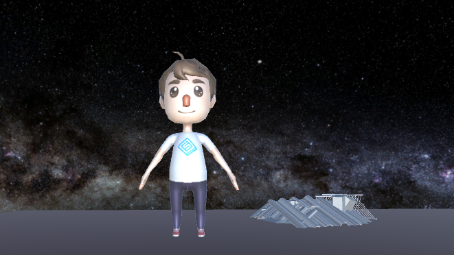

## Planet  

Der Planet wurde, nachdem es mit der Kugel einige Probleme gab (siehe aufgetretene Probleme), als Dodekaeder designed. Dieser besteht aus 12 Fünfecken, welche wiederum aus fünf Cubes bestehen. Wir haben hier nur Unity-Objekte verwendet, damit keine Probleme mit Collidern und Materialien auftreten. Jede der 12 Seiten stellt einen Beriech des Planeten dar, wie Beispielsweise den Wald, die Homebase oder den Lavasee mit Jumppassage.  
Die Designs der meisten Game-Objekte für die Bereiche haben wir in ScetchUp vorgenommen. Dort kann man flexiblere Objekte erstellen als in Unity, was das Spiel weniger statisch aussehen lässt. Es ist lediglich das Problem aufgetreten, dass die von Unity generierten Collider für die aus ScetchUp importierten Objekte nicht immer richtig funktionierten. Dieses Problem wurde jedoch durch die Änderung von Kugel zu Dodekaeder deutlich minimaler.  

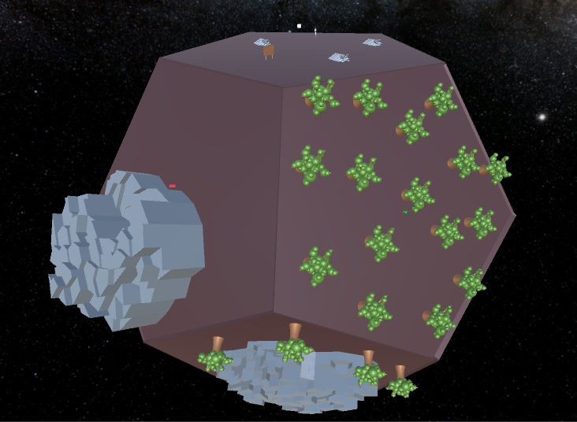

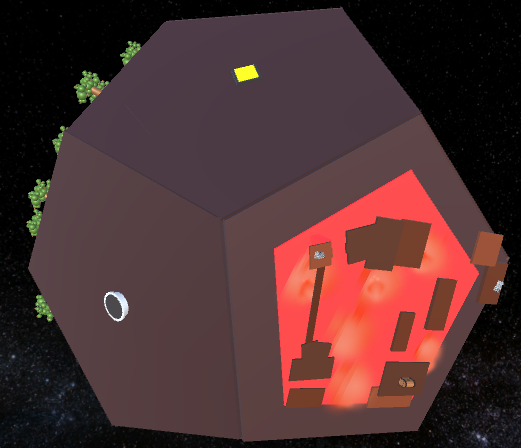

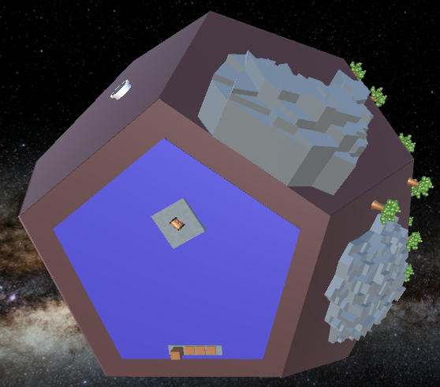  

### Gravitation

Die Gravitation musste bei der Änderung zum Dodekaeder ebenfalls verändert werden und besteht nun aus drei Scripten.  
Das GravityBody-Script wird zu allen Objekten hinzugefügt, die während des Spiels bewegt werden und vom Planeten angezogen werden müssen. Es sorgt dafür, dass das bestimmte Objekt vom richtigen Fünfeck angezogen wird. Bisher wird zu Beginn jeder GravityBody an die Homebase angezogen, was im nächsten Layer noch angepasst werden soll.  
Das GravityAttractor-Script wird zu jedem Fünfeck des Planeten hinzugefügt. Hiermit werden GravityBody-Objekte in die entsprechende Richtung rotiert und eine Schwerkraft wird hinzugefügt.  
Das GravityChanger-Script ist an Collider angebunden. Jedes Fünfeck des Planeten hat an seinen Kanten jeweils einen unsichtbaren Collider, durch den die GravityBodys hindurchfallen wenn sie sich über die Kante bewegen. Das Script sorgt dann dafür dass dem jeweiligen GravityBody die Gravitation des anliegenden Fünfecks übergeben wird. Während des Spiels sind aufgrund von besserer Performance nur die Collider des Fünecks aktiviert auf dem sich der Charakter befindet  

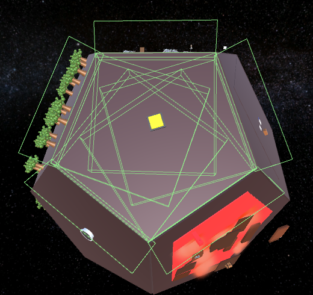

## Schrotthaufen  

Der Schrotthaufen ist ein klickbares Objekt, durch dessen Zerstörung der Spieler Schrauben erhält. Dafür wird das Werkzeug Schraubenschlüssel benötigt, das der Spieler von Anfang an besitzt. Es muss dreimal auf den Schraubenhaufen geklickt werden, um das Objekt zu zerstören und alle Schrauben zu erhalten. Pro Klick wird eine gewisse Menge an Child-Objekten des Schrotthaufens zerstört, um einen Fortschritt erkennen zu lassen.

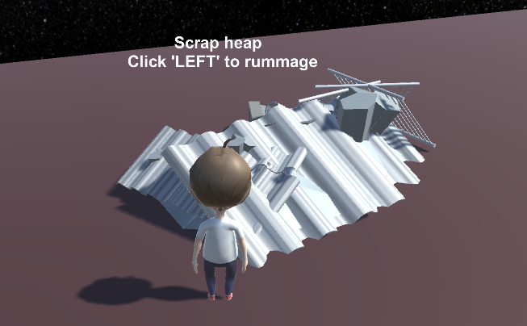

## Baum

Der Baum ist ein klickbares Objekt, durch dessen Zerstörung der Spieler Holz erhält. Dafür wird das Werkzeug Axt benötigt, das der Spieler in der Höhle findet. Es muss dreimal auf den Baum geklickt werden, um das Objekt zu zerstören und das ganze Holz zu erhalten. Pro Klick wird eine gewisse Menge an Child-Objekten des Baum zerstört, um einen Fortschritt erkennen zu lassen.

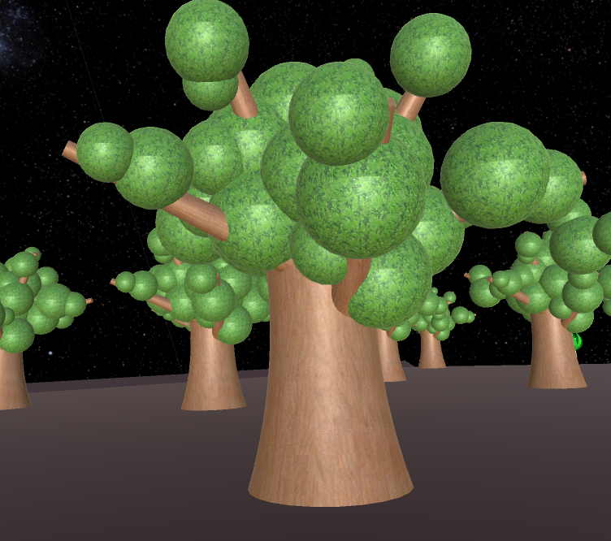

## Leiter  

Die Leiter muss mit dem Bauplan erstellt werden. Das dazu benötigte Holz hat der Spieler bereits gegeben, wohingegen er die Schrauben noch aus Schrotthaufen zusammensuchen muss. Wenn der Spieler die Leiter gebaut hat, kann er sie auf die klickbare Plattform vor dem Berg platzieren. Sobald die Leiter steht, wird sie zu einem klickbaren Objekt, das den Spieler auf die Spitze der Leiter teleportiert.

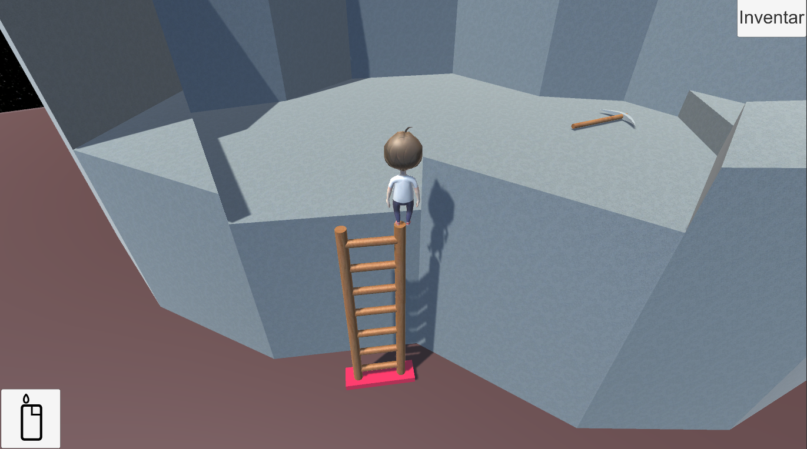

## Truhe

Die Truhe ist ein klickbares Objekt, das verschiedene Ressourcen enthält und sich beim Klicken öffnet. Zum Öffnen wird kein Werkzeug benötigt. Truhen können erst angeklickt werden, wenn der Spieler sich in einer gewissen Nähe zur Truhe befindet, um nicht das Klicken aus der Ferne zu ermöglichen.

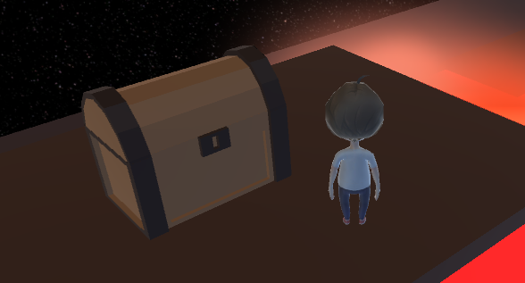
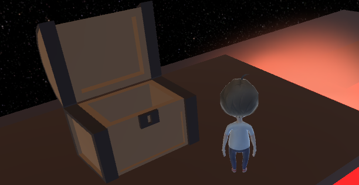

## Höhle  

Der Eingang der Höhle kann durch klicken zerstört werden, allerdings muss das Werkzeug Spitzhacke ausgewählt werden, welche sich auf dem Berg finden lässt. In der Höhle befinden sich die Axt und ein Diamant, die direkt aufgesammelt werden können, sowie eine Erzabbaustelle, die durch dreimaliges Klicken mit der Spitzhacke zerstört werden kann. Dadurch erhält der Spieler eine gewisse Anzahl an Metallerz.

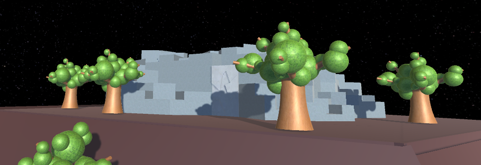

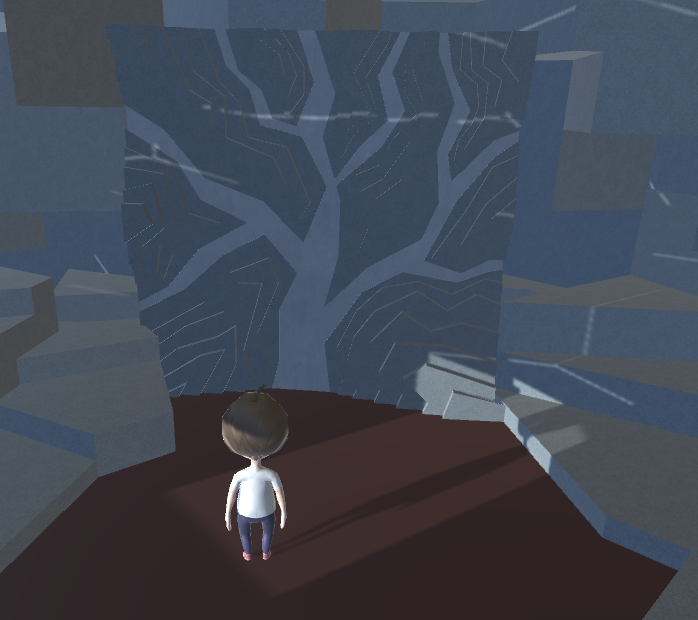

## Berg  

Auf dem Berg befindet sich die Spitzhacke, die mit einer Leiter erreicht werden kann.

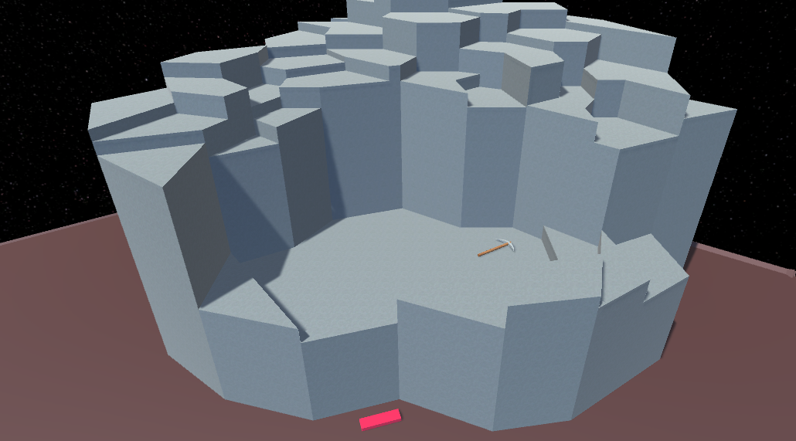

## Interaktion  

Für die Interaktionen mit Objekten werden die Funktionen OnMouseEnter, OnMouseExit und OnMousClick verwendet. Die ersten beiden Methoden lassen ein Textfeld anzeigen und wieder verschwinden, welches dem Spieler Auskunft über das ausgewählte Objekt und dessen Interaktionsmöglichkeiten gibt. OnMouseClick fürht dann die jeweilige Interaktion aus, zum Beispiel das Aufheben eines Items oder Werkzeugs.

## Crafting  

Das Crafting kann durch Interaktion des Bauplanschildes aufgerufen werden. Auf der linken Seite sieht der Spieler seinen Fortschritt des Baus der Rakete. Auf der rechten Seite befindet sich der aktuelle Bauplan, die Crafting-Slots sowie im unteren Bereich alle seine Items aus dem Inventar. Der Spieler kann nun jedes beliebige Item aus dem Inventar auf einen der 3 Crafting-Slots ziehen. Handelt es sich um eine gültige Crafting-Kombination, kann der Spieler den nun angezeigten, aber ausgegrauten, Gegenstand erstellen. Ist es eine ungültige Kombination bleibt der Craft-Button nicht interagierbar. Wird der Button bei einer validen Kombination gedrückt werden alle benötigten Items aus dem Inventar abgezogen und genau 1 Item der neuen Art hinzugefügt. Ist die richtige Anzahl von dem Endmaterial hergestellt worden, kann der Spieler nun die Endmaterialien in die Rakete einbauen oder wenn es ein Werkzeug ist, dieses aufnehmen. Zudem wird der aktuelle Bauplan abgeschlossen und der nächste Bauplan wird angezeigt.  
Falls der Spieler seine Erkundung fortsetzen möchte, kann er jederzeit das Crafting schließen, indem er den schließen Button oben rechts drückt.    

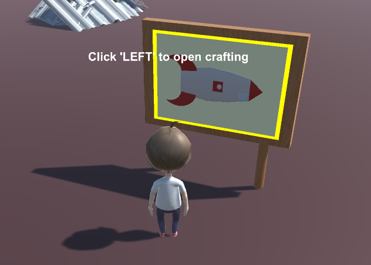  
   
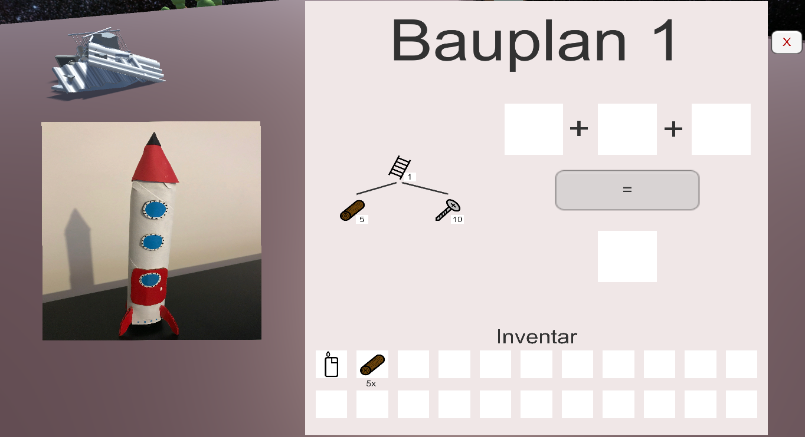

## Inventar  

Das Inventar zeigt dem Spieler welche Items er besitzt und wie viele davon. Während des Spiels, kann es über das HUD aufgerufen werden. Ruft man das Crafting auf, ist dort eine Anzeige des Inventars integriert. Für Testzwecke ist eine Grundausstattung bei Start des Spiels schon im Inventar. Beim richtigen Spiel wird das Inventar zu Beginn nur das für die Leiter benötigte Holz enthalten.   
Das Inventar ist nach dem Singleton-Prinzip aufgebaut und kann szenenübergreifend verwendet werden. Man kann also von überall auf das Inventar zugreifen, um z.B. Items dem Inventar hinzuzufügen, zu überprüfen, ob ein bestimmtes Item vorhanden ist, oder herauszufinden, welches Werkzeug gerade ausgerüstet ist. Alle verfügbaren Items sind in einem Enum deklariert.

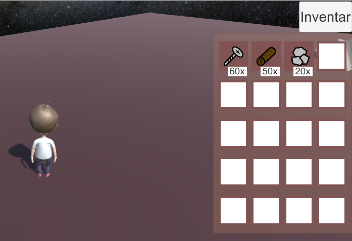

## HUD  

Der Spieler hat links unten seine Werkzeugauswahl. Diese ergänzt sich dynamisch um die Werkzeuge, die er im Laufe seiner Erkundung findet. Oben rechts befindet sich das Inventar. Klickt er auf den Button, kann er sehen, welche und wie viele Items er hat. Das Inventar kann mit dem Shortcut "e" geöffnet oder geschlossen werden. Die Werkzeuge können auch per Shortcuts ausgewählt werden. Die Shortcuts sind auf die Zahlen 1 - 6 verteilt.  

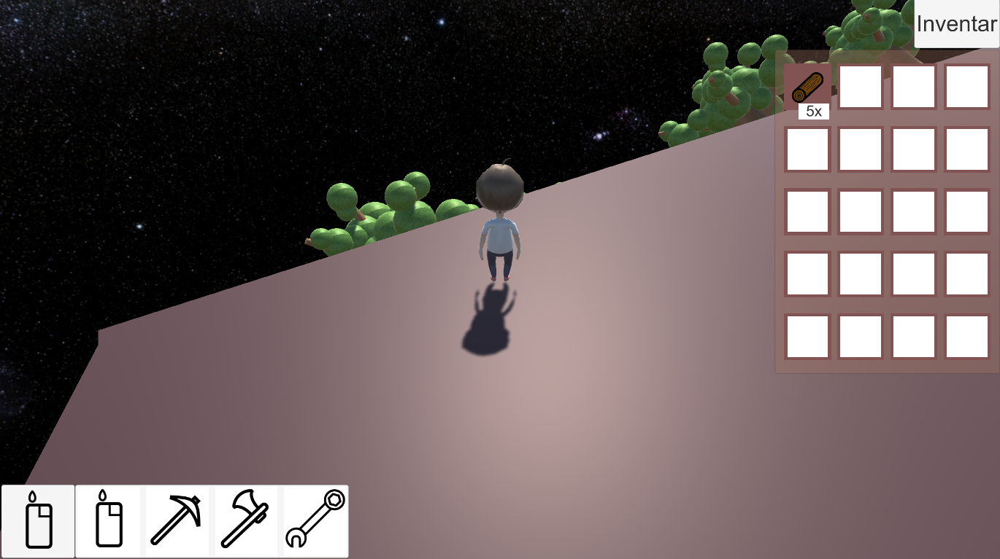

## Rätsel  

### Steinplatten  
Beim Steinplatten Rätsel gibt es zwei Druckplatten die man aktivieren muss um den Eimer zu bekommen der in einer Box liegt.
Um beide Platten zu aktivieren benötigt der Charakter einen zweiten Gegenstand wie beispielsweise einen Cube den man auf eine Druckplatte schiebt, sodass der Spieler die andere betätigen kann.

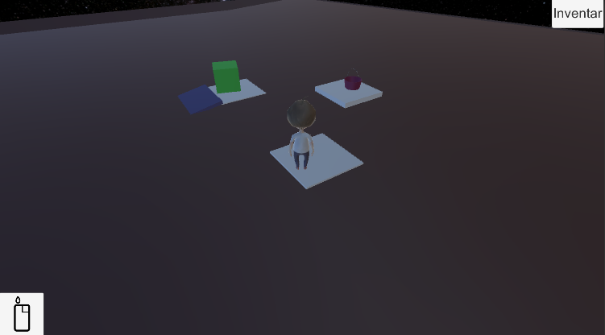

### Kistenrätsel  

Beim Kistenrätsel müssen vier Kisten mit vier verschiedenen Items befüllt werden. Welches Item in welche Kiste gehört, wird durch ein Symbol auf der Vorderseite der Kiste angezeigt. Befüllt man alle Kisten mit dem richtigen Item, erhebt sich eine Plattform aus dem Wasser, das sich neben dem Kistenrätsel befindet. Diese ermöglicht, die Kiste auf dem Berg zu erreichen. Es ist immer nur eine Kiste gleichzeitig oben und anklickbar, besitzt man das jeweilige Element noch nicht, wird das im Textfeld angezeigt. Zuerst wird Lava benötigt, die man beim Lava-Passagen-Rätsel mit dem Eimer aufsammeln kann. Den Eimer erhält man aber erst beim Steinplattenrätsel. Der Eimer hat drei Zustände, leer, Lava und Wasser. Anfangs ist er leer, auf Klicken von Lava oder Wasser wird er befüllt. Ist er schon befüllt und es wird wieder auf Wasser oder Lava geklickt, wird es durch das jeweilige Element ausgetauscht. Als nächstes benötigt man den Diamanten, der in der Höhle zu finden ist. Dann Wasser, das vom Wasser neben dem Kistenrätsel aufgesammelt werden kann. Und dann die Alienpflanze, die man im Wald findet und direkt aufgesammelt werden kann.

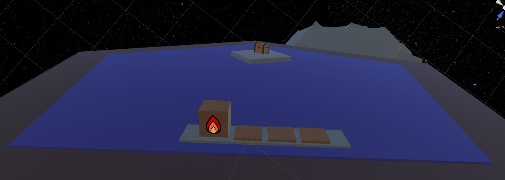

### Lava-Passage  

Auf dem Boden befindet sich in einem bestimmten Bereich Lava. Über der Lava befinden sich Plattformen. Der Spieler kommt von einer Plattform zur anderem, indem er Springt. Sollte er eine Plattform verfehlen, fällt er in die Lava rein und "stirbt". Er wird an den Startpunkt des Rätsels teleportiert und muss nun von vorne anfangen. Am Ende des Parcours wartet eine Truhe mit Items auf ihn.  
Nicht alle Plattformen sind statisch. Einige Plattformen bewegen sich vertikal hoch und runter. Dann gibt es noch die Lavafontäne. Hier wird in einem bestimmtem Intervall eine Lava Kugel nach oben geschossen. Berührt der Spieler diese Kugel, wird er auch zum Start teleportiert, da er "stirbt".  
Bei der Lava wurde ein Material genommen, welches eine Emission besitzt, sodass es ein wenig leuchtend aussieht. Zudem sind ein paar Partikelsysteme dabei, um die Lava realistischer aussehen zu lassen.

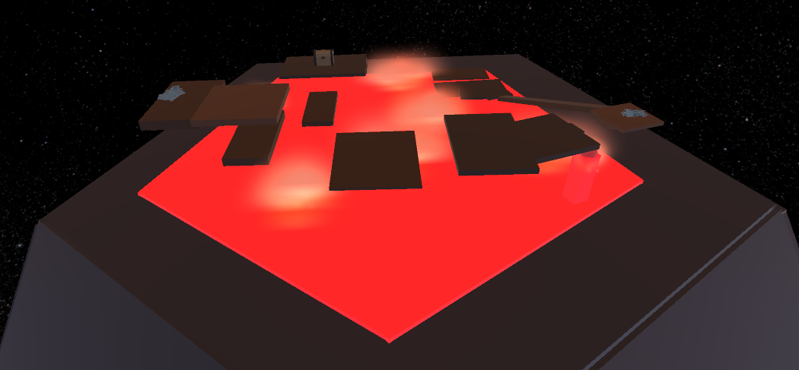

### Röhre  

Der Röhren-Eingang befindet sich auf dem Planeten, sobald der Spieler diesen betritt, wechselt sich die Scene und der Spieler fällt einen langen Schacht hinab. Dabei muss er Hindernissen ausweichen, die ihn sonst bei Berührung wieder auf den Planeten schicken. In der Röhre befindet sich eine Truhe, die der Spieler im Fallen berühren muss, um den Inhalt zu bekommen. Der Spieler kann zur Seite und nach oben und unten in Kamerasicht steuern. Sobald der Spieler den Boden berührt, wird er wieder auf den Planeten zurück teleportiert. Sollt er die Kiste nicht erwischt haben, muss er nochmal die Röhre betreten.

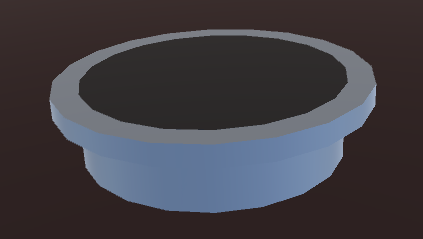

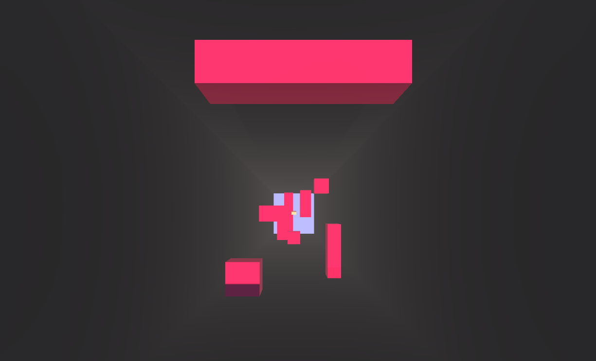
