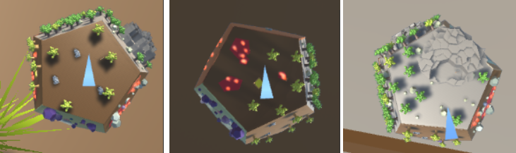
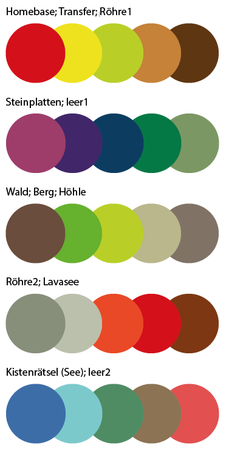
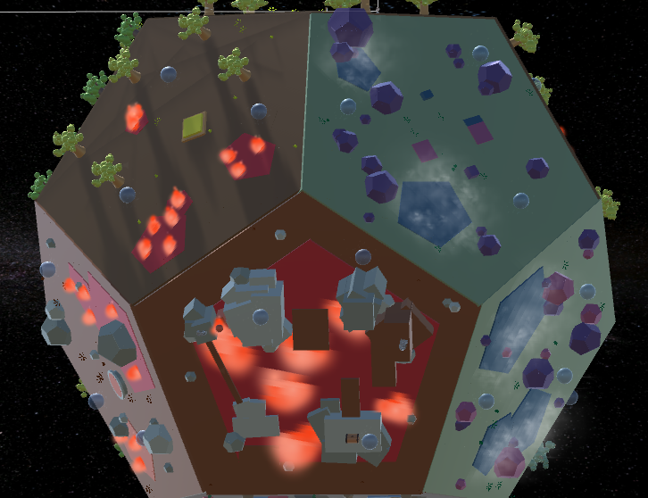
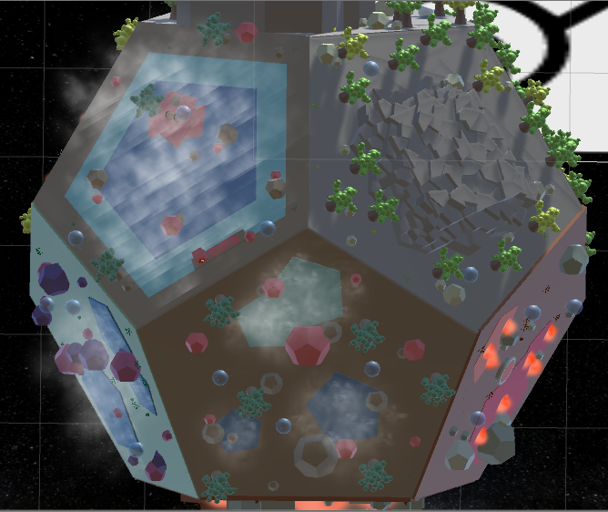
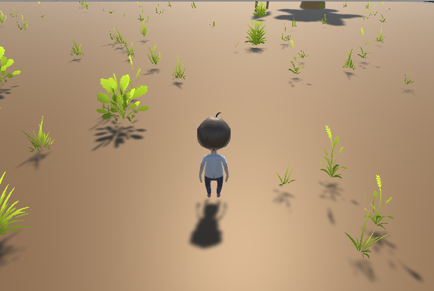
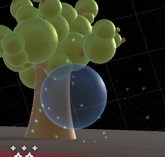
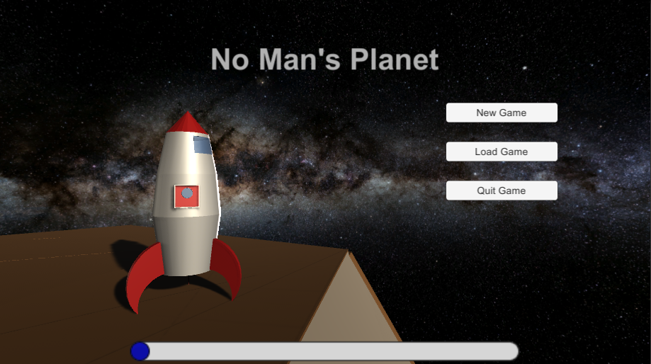
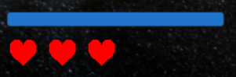
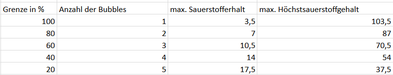

# Alpha-Release

## Allgemeines  

Wir haben Teile der Priorisierung der Layer anpassen müssen. Layer 2 ist nun komplett fertig. Die Erstellung des Torus sowie weitere Rätsel auf dem Torus haben wir in Layer 4 verschoben. Dafür haben wir noch weitere Spieleinflüsse erstellt (siehe Sauerstoff und Leben). Somit haben wir auch Layer 3 abgeschlossen.  

Über den Entwicklungszeitraum konnten wir kleinere Bugs fixen und Verbesserungen vornehmen, welche im folgenden nicht erwähnt werden.  

## Tutorial
Das Tutorial beschreibt die ersten zwei Schritte die man braucht um seine Leiter zu bauen.  
Man sieht es am linken Bildschirmrand wenn man beginnt zu spielen. Es gibt ein Button der das Tutorial schließen und wieder öffnen kann. Sind die einzelnen Aufgaben erfüllt wird das Objekt zerstört.

## Pause Menu
Das Pause Menu wird geöffnet/geschlossen indem man Escape drückt. Von dort aus kann man zurück ins Main Menu oder das Spiel beenden.  
Hierbei war zu beachten, dass das Spiel während der Anzeige tatsächlich pausiert, damit der Spieler währenddessen nicht weiterlaufen kann.

## Minimap

Wir haben dem HUD des Spielers unten rechts eine Minimap hinzugefügt. Sie verschafft dem Spieler einen Überblick über die aktuelle sowie die angrenzenden Plattformen. Außerdem wird der Spieler mithilfe eines Dreiecks hervorgehoben, wessen Spitze in die aktuelle Blickrichtung des Spielers zeigt.  

Realisiert ist die Minimap mit 24 Kameras, je 2 für eine Plattform. Eine Kamera zeigt den Planeten, die andere rendert nur das Spielerdreieck. Das Dreieck wird durch ein Mesh erstellt. Die Lichtquellen haben keinen Einfluss auf das Aussehen des Materials des Dreiecks. Außerdem ist es ein Kindelement vom Spieler, sodass es diesem immer folgt. Die Hauptkamera rendert das Dreieck nicht mit.  

## Farbschema

Um die 12 Plattformen unterschiedlicher zu gestalten, haben wir verschiedene Farbschemata erstellt. Ein Farbschema umfasst zwei oder drei angrenzende Plattformen, die neben den gemeinsamen Farben auch ein ähnliches Design haben.

Die Collectables und die Tools sind von den Farbschemata ausgenommen, damit sie sich besser von der Umgebung abheben.

## Neues Design der einzelnen Plattformen

Das Design der einzelnen Plattformen haben wir an die Farbschemata angepasst und weiter verfeinert, sodass der Spieler mehr zu entdecken hat. Welche Objekte hinzugefügt wurden hängt von den verschiedenen Farbschemata ab.

##### Farbschema 1: Homebase; Transferplattform; Röhre1  
(Bild links; Plattform oben links)  
Auf diesen Plattformen befinden sich mehrere Bäume, sowie kleinere Lavaseen. Lediglich auf der HomeBase befinden sich keine dieser Seen, da diese Plattform eine sichere Zone sein soll auf der man nicht sterben kann.

##### Farbschema 2: Steinplattenrätsel; leere Plattform1
(Bild links; Plattform oben rechts)  
Hier befinden sich neben den Rätselobjekten lediglich Steine in verschiedenen Farben und Seen aus Wasser.

##### Farbschema 3: Wald; Berg; Höhle
(Bild rechts; Plattform oben rechts)  
In diesen Bereichen befinden sich viele Bäume. Jene mit hellen Blättern sind abbaubar um Holz zu erhalten, wohingegen die mit dunklen Blättern nicht abbaubar sind. Zur weiteren Gestaltung befinden sich hier auch ein paar Steine.

##### Farbschema 4: Röhre2; Lavasee
(Bild links; Plattform unten)  
Diese Plattformen sind hauptsächlich durch Lava beeinflusst. Neben den Lavaseen befinden sich nur Steine in diesen Bereichen.

##### Farbschema 5: Kistenrätsel (See); leere Plattform2
(Bild rechts; Plattform oben links und unten)  
Diese Plattformen sind durch Seen aus Wasser bestimmt, enthalten jedoch auch Bäume und Steine.

##### Gras
Auf allen Plattformen befindet sich Gras in angepassten Farben, welches zu Beginn des Spiels erstellt wird. Es wurde darauf geachtet, dass es nicht innerhalb von Seen oder wichtigen Spielobjekten landet.

##### Sauerstoffpartikel
Wir haben für den einsammelbaren Sauerstoff ein Partikelsystem und eine Sauerstoffblase erstellt, welche zusammen jeweils drei mal auf den Ebenen enthalten sind (weiteres dazu im Punkt 'Sauerstoff und Leben'). Dass auf der Homebase kein Sauerstoff verbraucht wird, wird dadurch gekennzeichnet, dass das Partikelsystem um die Plattform herum zu sehen ist. Auf der Homebase sind dadurch auch keine Sauerstoffblasen zu finden.

## Speichern & Laden mit Checkpoints

### GameDataManager (GDM)

Der GameDataManager (kurz: GDM) ist eine zentrale Klasse des Spiels. Er sorgt dafür, dass die Scene nach einem Wechsel der Scene noch genauso aussieht wie davor. Außerdem ermöglicht er das Speichern, Laden und Resetten des aktuellen Fortschritts und passt die Scene daraufhin an. Desweiteren kann man über diese Klasse z.B. auf das Inventar zugreifen, sowie spielerbezogene Daten herausfinden oder verändern (Sauerstoff, Anzahl der Leben).  
Jedes Interaktive Objekt registriert sich einmalig beim GDM. Ändert es seinen Zustand bekommt der GDM es mit und kann es in der GameData speichern. Wenn ein Checkpoint erreicht wird, wird der aktuelle Fortschritt als JSON gespeichert und kann so zu einem beliebigem späteren Zeitpunkt wieder eingelesen werden.  

### Checkpoints

Ein Checkpoint speichert den aktuellen Fortschritt des Spiels. Erreicht wird er durch das Vollenden eines Bauplans. Verliert der Spieler alle seine Leben, wird das Spiel auf den Zustand des vorherigen Checkpoints zurückgestellt.  

### GameData

Die GameData-Klasse speichert alle Daten jedes interaktiven Objektes und sorgt für den Zugriff auf die Daten.  

### InteractData

Jedes interaktive Objekt braucht bestimmte Basisdaten, damit es z.B. bei einem Reset neu instanziiert werden kann. Die Klasse InteractData ist die Basisklasse, von der alle anderen erben.  

## Hauptmenü

Im Hauptmenü kann man ein neues Spiel starten oder ein aktuelles Laden. Des weiteren kann die Sprache geändert werden.  

### LanguageManager  

Der LanguageManager ist eine Klasse für die Verwaltung der angezeigten Sprache. Über eine Methode kann man die aktuell ausgewählte Sprache ändern. Momentan sind Englisch und Deutsch verfügbar.  

## Sauerstoff & Leben

### Leben  

Als neues Feature besitzt der Spieler nun 3 Leben und verbraucht Sauerstoff. Das HUD zeigt beides an.  

Stirbt der Spieler, indem er beispielsweise Lava oder Wasser berührt, verliert er ein Leben und respawnt auf derselben Plattform. Verliert er alle 3 Leben, wird sein Spielfortschritt auf den letzten Checkpoint zurückgesetzt (siehe Checkpoints)  und er startet erneut von der Homebase.  

### Sauerstoff  

Zur Sauerstoffanzeige wird auf dem UI ein Slider benutzt. Der Spieler hat maximal einen Sauerstoffgehalt von 100 und kann während des Spiels auf unterschiedliche Weise Sauerstoff verlieren:   
- konstanter Sauerstoffverbrauch auf allen Plattformen, außer auf der Homebase (0,166 alle 500ms),
- beim Rennen (0,001),  
- beim Rückwärtsrennen (0,005),  
- beim Laufen (0,005),  
- beim Rückwärtslaufen (0,00005),  
- beim Springen (0,0005).

Aus diesen Werten ergibt sich, dass der Spieler nach 5 Minuten durch Sauerstoffmangel sterben würden, wenn er sich nicht bewegt und dementsprechend schneller wenn er den Planeten erkundet.  

### Sauerstoffblasen  

Da der Spieler an Sauerstoffmangel sterben kann, gibt es eine Möglichkeit seinen Sauerstoff aufzufüllen: die Sauerstoffblase. Hierfür wurde auch ein Partikelsystem für die Sauerstoffblasen erstellt um die Aufmerksamkeit des Spielers zu bekommen. Diese spawnen alle 2 Minuten in Abhängigkeit des aktuellen Sauerstoffgehaltes auf verschieden vielen Plattformen. Hier ist eine genauere Verteilung der Sauerstoffbalance:

## Sound

Zu den meisten Aktionen mit Objekten (z.B. Aufheben des Eimers, Zerstören der Schrotthaufen) wurde ein individueller Sound hinzugefügt, um das Spiel etwas lebhafter zu machen. Auch im Hauptmenü wurde Musik eingefügt.

## Feuerzeug

Wenn man das Feuerzeug ausgewählt hat, wird eine Lichtquelle beim Spieler erzeugt um somit dunkle Orte zu erhellen. Ebenso haben wir nun eine Abfrage beim Höhlen Eingang erstellt, damit man nur mit ausgewähltem Feuerzeug hinein gehen kann.

## Performance  

Die Allgemeine Performance wurde erhöht indem die Update Methode nur ausgeführt wird, wenn der Spieler sich direkt auf dem Pentagon befindet. Weiterhin werden die Partikelsysteme nur aktiv, wenn der Spieler auf dem Pentagon steht, auf dem sich auch das System befindet oder auf einem direkt angrenzenden Pentagon.  

Diese Implementierung basiert auf dem Observer Pattern. Es gibt einen PentagonChanger dort registrieren sich alle Klassen die darauf horchen wollen, wenn das aktuelle Pentagon gewechselt wird. Die Klasse PentagonUpdater implementiert so ein Listener dazu. Hauptsächlich wird im PentagonUpdater ein Boolean in Abhängigkeit des aktuellen Pentagons und des Pentagons, wo das GameObject sich befindet, gesetzt. Dieses kann verhindern, dass die Update komplett ausgeführt wird.  

## Aufgetretene Probleme  

Die Minimap richtet sich momentan nicht immer so aus, dass die Blickrichtung des Spielers nach oben zeigt.
Ebenso war die Implementierung des Speichern und Ladens mit sehr vielen Problemen verbunden, da viele Objekte und viele verschiedene Arten des neu Ladens beachtet werden mussten.
Zusätzlich hatten wir geplant mehr Lichtquellen einzubauen, was jedoch zu erheblichen Performance Störungen geführt hat, weshalb wir es doch bei einer Lichtquelle belassen haben.
