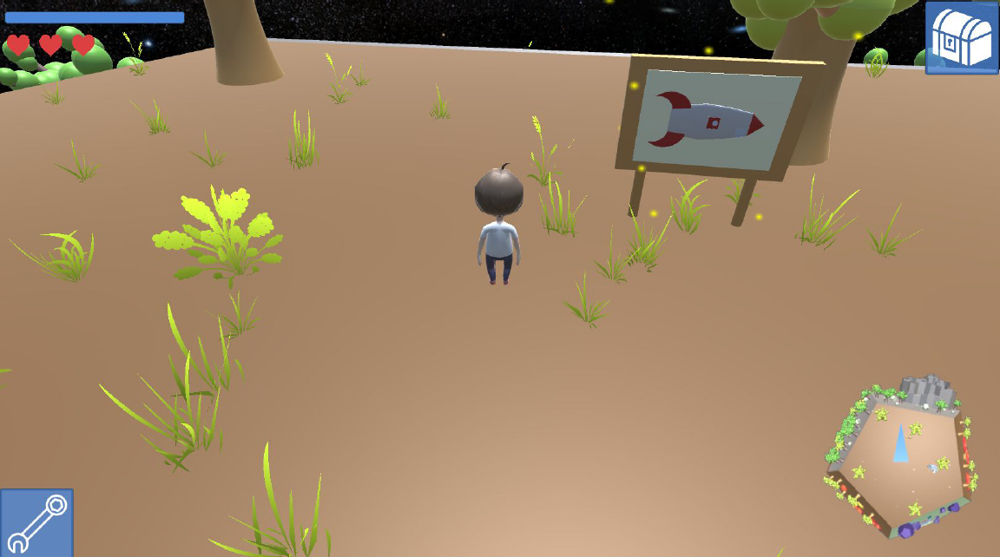
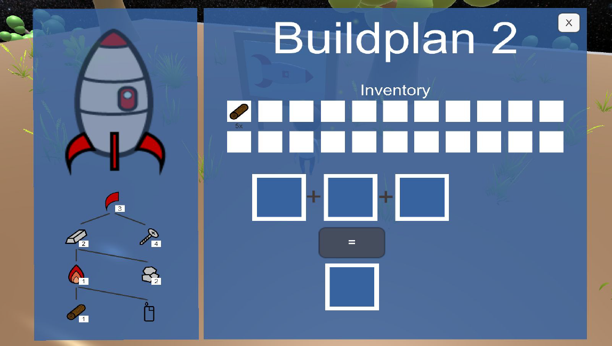
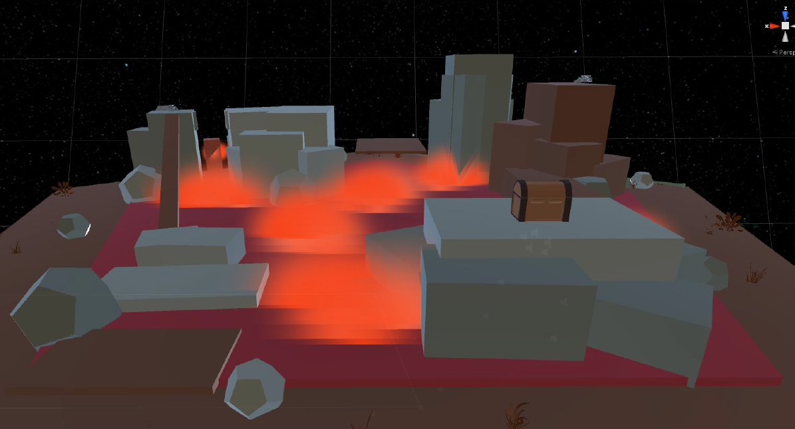
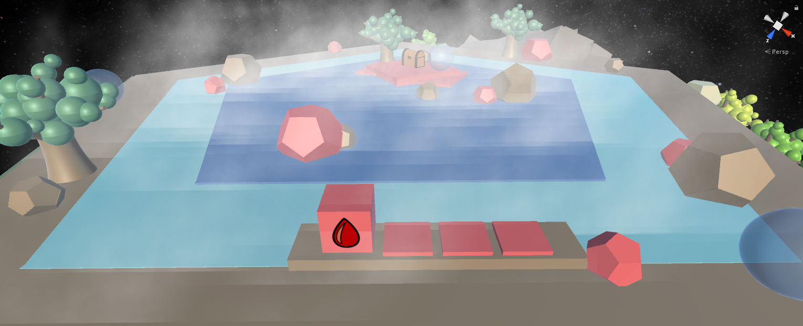

# Final Release  

  

  

  

  

## Änderungen seit dem Alpha Release  

### Allgemein

Über den Entwicklungszeitraum konnten wir kleinere Bugs fixen (insbesonders in Bezug auf den Szenenwechsel bzw. den Reset) und Verbesserungen vornehmen, welche im folgenden nicht erwähnt werden.  

### Sauerstoff    

Den Sauerstoff haben wir leicht angepasst, sodass man nicht so häufig an Sauerstoffmangel stirbt. Die Blasen erscheinen hierzu in einem kürzeren Abstand und bringen zudem mehr Sauerstoff für den Charakter.

### Leben  

Es gibt nun die Möglichkeit Leben zu erhalten, indem man gewisse Aufgaben abschließt, welche der Spieler selber herausfinden muss. Bisher erhält man ein Leben, wenn man ein Rätsel abgeschlossen hat und man alle Abbaubaren Elemente einer Art abgebaut hat.

### Minimap  

Die Minimap ist nun etwas größer. Dadurch kann man besser sehen, wo man sich auf dem Planeten befindet. Zudem ergänzten wir blaue Homebase-Marker an den Rändern der Pentagone. Sie zeigen an, über welche man am schnellsten zurück zur Homebase gelangt.

### Tipp-System

Beim Tipp-System haben wir einiges angepasst. Es gibt nun eine Einleitung, welche die Spielidee sowie die Steuerung erklärt. Die Tipps im Spielverlauf wurden ebenfalls etwas genauer formuliert und teilweise wurden zusätzliche hinzugefügt. Außerdem nehmen die Tipps nun den gesamten Bildschirm ein und müssen vom Spieler aktiv weggelickt werden. So wird vermieden, dass ein Tipp übersehen wird oder nicht komplett gelesen werden kann.

### Falling Tube  

Der Schwierigkeitsgrad der Röhre wurde nochmal angepasst. Durch das Partikelsystem der Truhe ist sie jetzt schneller zu erkennen und man kann nicht mehr durch Berühren der Wände, sondern nur noch der Hindernisse sterben. Zusätzlich wurde die Steuerung für eine einfachere Bedienung überarbeitet.

### Audio  

Bei den Objekten, die bei Interaktion Audio abspielen sollen und zerstört werden, wird jetzt die AudioSource der Kamera verwendet. Es wurden noch weitere Audios im Spiel hinzugefügt.

### UI - HUD Design

Die Werkzeug- und Inventarknöpfe sowie das UI des Bauplans haben wir nochmal überarbeitet. Sie sind jetzt blau, der Inventarknopf hat jetzt ein Icon anstatt dem Text und die einzelnen Bauplanteile wurden nochmal neu angeordnet.

### Interactables  

Um besser sehen zu können, mit welchen Objekten interagieren kann, haben wir ein Partikelsystem eingefügt, dass über den jeweiligen Interactables schwebt.

### Serialisierung  

#### Speicherung  

Das Spiel wird nun häufiger gespeichert. Da die Speicherung bei Abschluss eines Bauplans teilweise zu weit auseinander lag, wird nun nach der Erstellung eines Endelements gespeichert.

#### Kistenrätsel  

Das Kistenrätsel wird nun auch serialisiert, indem der Status jeder Kiste persistiert wird. Es wird ggf. bei einem Reset auf den vorherigen Stand zurückgesetzt. Außerdem haben wir das Lava-Icon angepasst, sodass es sich vom Feuer-Icon aus dem Crafting unterscheidet.

#### Steinplattenrätsel  

Beim Steinplattenrätsel wird nun die Position des Steines, sowie der Fortschritt des Rätsels gespeichert. Nach einem Reset bzw. Szenenwechsel bleibt der Status des Rätsels gleich. Zusätzlich wurden Rampen an beiden Steinplattformen hinzugefügt, sodass der Spieler frei wählen kann auf welche er den Stein schiebt.

### Hauptmenü  

Im Allgemeinen ist der Szenenwechsel zwischen der Hauptszene und dem Hauptmenü verbessert worden.

#### Spracheinstellung  

Es ist nun möglich zwischen momentan zwei Sprachen (Deutsch und Englisch) zu wechseln. Die Einstellung kann man im Hauptmenü auswählen.  
Die Funktion für den Sprachenwechsel wird über den LanguageManager zur Verfügung gestellt. Die Klasse funktioniert nach dem Observer-Pattern. Alle Klassen, die einen Text auf dem UI anzeigen wollen, registrieren sich bei dem LanguageManager, um den Text in der richtigen Sprache zu erhalten. Die Spracheneinstellung wird in einer separaten JSON Datei gespeichert. So kann auch sichergestellt werden, dass die zuvor ausgewählte Sprache bei einem Neustart des Spiels die zuletzt ausgewählte ist.

#### Neues Spiel  

Ein Neues Spiel kann nun vernünftig gestartet werden. Wenn ein aktueller Spielfortschritt persistent ist, wird dieser nun gelöscht. Zudem zeigt der ToolChooser nun die richtigen Tools an.

#### Pause Menü

Im Pause-Menü ergänzten wir den "Fortsetzen"-Button.

## Allgemeine Fragen  

### Wie gut ließen sich Ihre anfänglichen Ideen in das finale Spiel umsetzen? Konnten Sie Ihre Zeitplan umsetzen?  

Die Puzzles ließen sich sehr gut umsetzen sowie die einzelnen, verschiedenen Regionen des Planeten.  
Wir konnten Layer 3 komplett abschließen. Wir mussten jedoch einige Aufgaben aus den Layern verschieben, weil wir gemerkt haben, dass sie in dem neuen Layer besser angesiedelt sind.

### Wo sind Sie stark davon abgewichen?  

Anfangs war die Überlegung, ein Puzzle-Survival-Spiel zu entwickeln, aber der Survival-Part ist dann doch erstmal untergegangen. Erst durch das Hinzufügen des Sauerstoffes und der Leben wurde dieser Teil etwas umgesetzt.
Außerdem sollte der Planet am Anfang rund sein. Dies führte jedoch zu dem Problem, dass eckigen Objekte nicht richtig auf dem Planeten platziert werden konnten, was zu Interaktionsschwierigkeiten mit dem Charakter geführt hat. Dadurch sind wir auf einen Dodekaeder umsteigen, was unserem Spiel aber letztendlich etwas Außergewöhnliches verleiht.

### Wie haben die Elemente des Kurses (Entwicklungsplan, Prototyp, Playtesting etc.) das Fortkommen im Kurs begünstigt oder behindert?  

Der Entwicklungsplan war wichtig um zu definieren, welche Aufgaben implementiert werden sollen. Der Prototyp wurde für uns doch recht aufwendig, aber wir haben dadurch eine Idee der Spielwelt bekommen. Das Playtesting war essentiell. Dadurch haben wir interne Bugs sowie Spielerrückmeldungen bekommen, was verbessert werden könnte. Die Verschriftlichung in das Tagebuch hielt die ersten Ideen des Spiels fest. Wir haben zwar die Summe von 1000 Wörtern zusammenbekommen, fanden aber, dass wir einige Sachen redundant geschrieben haben(mehr dazu in den Verbesserungsvorschlägen).  

### Konnten Sie Ihre Erwartungen umsetzen? Sind Sie stolz auf das Spiel?  

Wir konnten unsere Erwartungen zu den größten Teilen umsetzen. Es gab einige Änderungen z.B. dass der Planet ein Dodekaeder ist und keine Kugel. Aber alles in allem sind wir sehr stolz auf unser erstes selbst erstelltes Spiel "No Man's Planet". Bestätigt wurde dies von den Testpersonen des Alpha Release.

### Hatten Sie genug Zeit?  

Wir hatten meistens Zeitprobleme zum Ende eines Meilensteins, konnten diese jedoch trotzdem erfolgreich abschließen. Insgesamt wurde der zeitliche Aufwand unseres Projektes jedoch unterschätzt, was zu Zeitproblemen geführt hat(mehr dazu in den Verbesserungsvorschlägen).

### Was war die größte technische Schwierigkeit?  

Die größte Schwierigkeit ist die Implementierung der Spielersteuerung sowie der Kamera im Verbindung mit unserer spezifischen Gravitation.

### Sind Sie mit dem Thema des Kurses klar gekommen?  

Ja, das Thema bietet Platz für sehr viele Spielgenres, sodass wir trotz der Vorgabe eine Freiheit in der Umsetzung hatten.

### Hat Ihnen die Arbeit mit dem Thema Spaß gemacht, oder hätten Sie lieber mehr Freiheit gehabt?  

Die Vorgabe eines Themas fanden wir zu Beginn eher hinderlich, haben dann aber gemerkt, dass man dadurch fokussierter bei der Spielidee ist. Der Findungsprozess wurde dadurch letztendlich doch ausgereifter(mehr dazu in den Verbesserungsvorschlägen).

### Was würden Sie bei Ihrem nächsten Spiel anders machen?  

Gleich zu Beginn ein Management zur Szenen-Bearbeitung einrichten.

### Was war der größte Erfolg während der Projektes? War das Projekt ein Erfolg?  

Durch abwechslungsreichen Inhalt sowie den einzelnen Rätseln motivieren wir die Spieler "No Man's Planet" aktiv zu spielen. Die dadurch entstehende und benötigte Spielzeit empfinden wir als den größten Erfolg. Während der Playtesting-Phase wurde die Spielidee sehr gelobt, was uns umso stolzer macht. Alles in allem ist also auch unser Projekt ein Erfolg. Bestätigt wurde das von den Testpersonen, die ein hohes Potential zu einer Veröffentlichung des Spiels sehen.

### Mochten Sie Unity?  

Ja! Nach der Einarbeitung in Unity empfanden wir die Software als sehr produktiv und förderlich.  
Bei uns gab es leider Probleme mit dem Importieren von Modellen. Das Material wurde nicht korrekt angezeigt. Irgendwann hat es dann geklappt.
